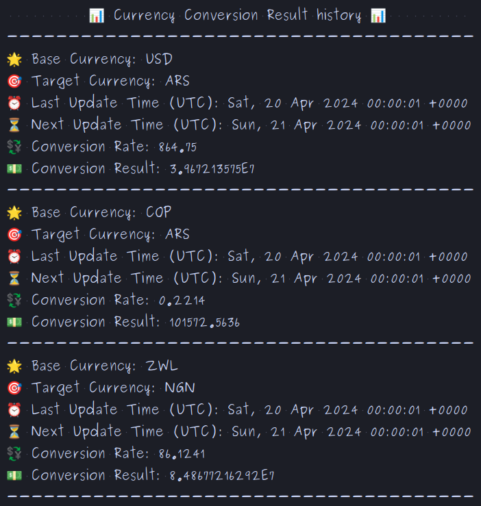

<h1>Currency Conversion Project 💱</h1>

<h2>

## Description

</h2>
<h4>

This currency conversion project allows users to access updated information on currency exchange rates, perform
conversions between different currencies, and maintain a transaction history. It utilizes
the [ExchangeRate-API](https://v6.exchangerate-api.com/v6/) to fetch accurate and up-to-date data on exchange rates.
</h4>

## Main Features

### View Currency Values
<h4>
  
  This option allows users to view the current values of different available currencies. It provides an overview of the
  most recent exchange rates.
  
</h4>

### Check Specific Currency

With this feature, users can check the specific value of a selected currency. It's useful for obtaining detailed
information about a particular currency.

### Convert Currency

It allows users to convert between different currencies using current exchange rates. It's a handy tool for conducting
international financial transactions.

### Conversion History

This feature records and displays the history of all conversions made by the user. It facilitates tracking of past
transactions and financial management.

## Project Architecture

### API Connection Class

A dedicated class has been implemented to manage the connection to the ExchangeRate-API. This class utilizes the
standard `java.net.HttpURLConnection` library to establish secure HTTP connections and send GET requests to the API URL.

### Gson Library Usage

For processing JSON data received from the API, the project makes use of the Gson library. This tool easily converts
JSON objects to Java objects and vice versa, facilitating data manipulation in the project.

### Data Storage Class

Additionally, a specific class has been designed for storing conversion data. This class records all conversions made
during the current user session, enabling quick and efficient access to the transaction history.

## Project Benefits

- Provides an intuitive and easy-to-use interface for currency conversion.
- Utilizes accurate and up-to-date data from the ExchangeRate-API.
- Offers a detailed history of all transactions made.
- Implements a robust and scalable architecture to ensure optimal performance.

With this architecture and features, the project offers a comprehensive and effective solution for users' currency
conversion needs, combining modern technology and ease of use.
